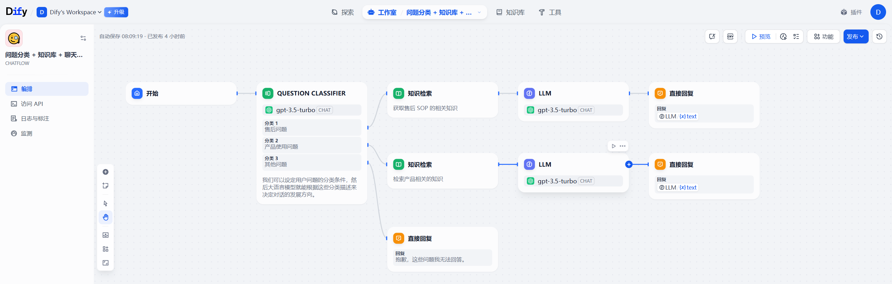

# dify_client_node

## Introduction

This package is the client node for [DIFY](https://cloud.dify.ai/apps), which is a platform for building artificial intelligence. It contains two main function:

- Sub Part: Subscribe the asr msg for dify client query.

- Pub Part: Publish the dify inference result.

## Usage

1. Publish a dify application



2. Run Package on RDK. See 'Run' Part below.

## Run

### Dify Client Node
```shell
source /opt/ros/humble/setup.bash
source ./install/setup.bash
export DIFY_KEY=xxx
ros2 run dify_client_node dify_client --ros-args -p asr_msg_sub_topic_name:=/asr_text -p string_msg_pub_topic_name:=/tts_text
```

### Pub Node
```shell
source /opt/ros/humble/setup.bash
ros2 topic pub --once /asr_text std_msgs/msg/String "{data: ""苹果怎么用？""}"
```

### TTS

```shell
source /opt/tros/humble/setup.bash
ros2 run hobot_tts hobot_tts --ros-args -p playback_device:="plughw:1,0"
```
Tip: more usage see [hobot_tts](https://github.com/D-Robotics/hobot_tts).

## Result
```bash
[WARN] [1761568288.935492327] [dify_client_node]: Dify Client Node has been started.
[INFO] [1761568293.635967635] [dify_client_node]: 收到ASR文本: 苹果怎么用？
[WARN] [1761568302.266726665] [dify_client_node]: 将苹果洗净后，你可以直接吃生的，也可以将其切成薄片或块状，加入沙拉中。另外，你还可以用苹果制作果汁、果酱、苹果派或苹果酥等甜点。总的来说，苹果是一种非常多样化的水果，可以生吃也可以用来烹饪。
```